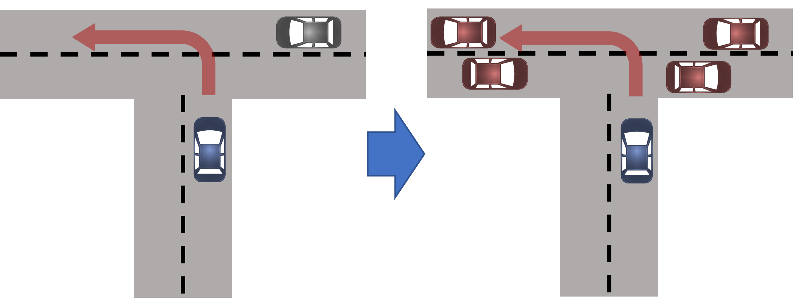
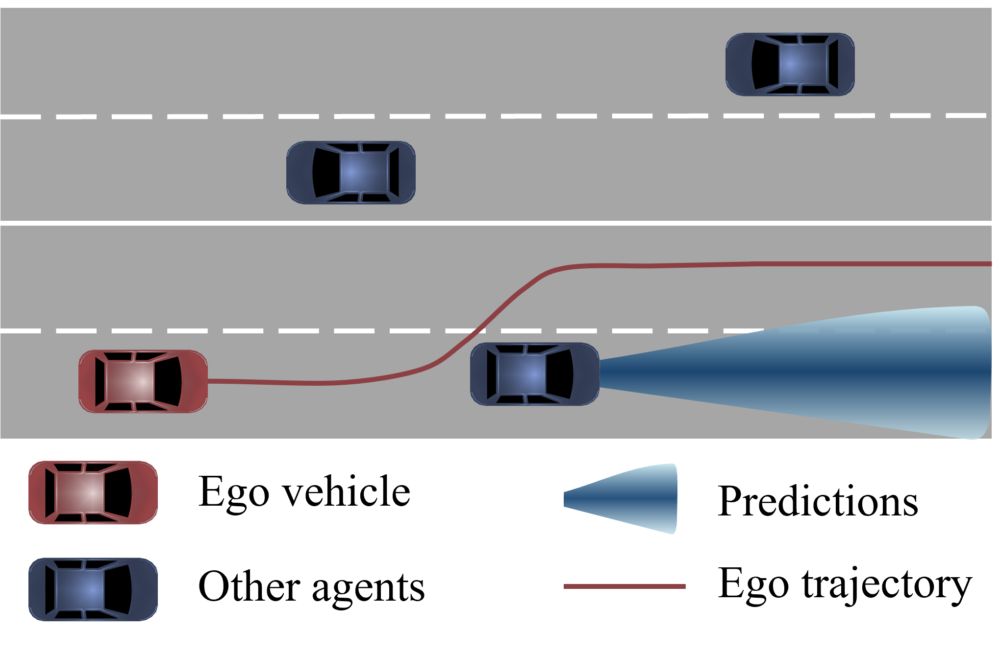

Reliable Intelligent Systems Lab (RISL) at Rensselaer Polytechnic Institute (RPI) researches methods for improving the safety, trustworthiness, and generalizability of intelligent systems. The topics of interest include reachability analysis, decision-making under uncertainty, runtime monitoring, behavior modeling, and transfer learning. The lab's application areas include aerial robotics, mobile robot navigation, and autonomous driving. 

**How to Join**

RISL will take multiple Ph.D. students for Fall 2024. If you are interested in joining RISL and doing research in the areas below, you need to (and you are encouraged to) submit a Ph.D. application to [ECSE at RPI](https://ecse.rpi.edu/ "ECSE") (Deadline: January 22, 2024). If you have specific questions or research ideas, please reach out to Esen Yel by email (yele@rpi.edu) with the subject line "Interested in joining RISL".

Research Areas
=====

Adaptation to Unforeseen Situations
-----

   

Autonomous systems may need to operate under different conditions than they have been designed for (e.g., unforeseen faults, different environment settings, etc.). To deal with this problem, the systems need to be able to adapt their models to new situations without the need for large amounts of data. Our work has focused on leveraging meta-learning and Bayesian techniques to provide adaptation to unforeseen conditions.

**Relevant Publications:**
* A. Yildiz,  **E. Yel**, A. Corso, K. Wray, S. Witwicki and M. Kochenderfer, "_Experience filter: Transferring past experiences to unseen  tasks or environments_", IEEE Intelligent Vehicles Symposium (IV) 2023 [PDF](https://arxiv.org/pdf/2305.18633.pdf "IV'23")
* **E. Yel***, Shijie Gao*, N. Bezzo, ”_Meta-Learning-based Proactive Online Planning for UAVs under Degraded Conditions_”, (*equal contribution), Robotics and Automation Letters (RA-L), 2022 [PDF](https://ieeexplore.ieee.org/document/9832491 "RAL'22")
* **E. Yel**, N. Bezzo, ”_A Meta-Learning-based Trajectory Tracking Framework for UAVs under Degraded Conditions_” IEEE/RSJ International Conference on Intelligent Robots and Systems (IROS) 2021 [PDF](https://arxiv.org/abs/2104.15081 "IROS'21")
* **E. Yel**, N. Bezzo, ”_GP-based Runtime Planning, Learning, and Recovery for Safe UAV Operations under Unforeseen Disturbances_” IEEE/RSJ International Conference on Intelligent Robots and Systems (IROS) 2020 [PDF](https://ieeexplore.ieee.org/document/9341641 "IROS'20")
  
Assured Autonomy
-----

Autonomous systems can be subject to uncertainties due to external disturbances or due to the use of internal learning-based components. Since these systems are mainly used in safety-critical settings, it is important to assess the safety of the system before and during its deployment. Our research uses reachability analysis and neural network verification techniques to provide safety-critical autonomous systems with such capabilities.

**Relevant Publications:**
* N. Rober, S. M. Katz, C. Sidrane, **E. Yel**, M. Everett, M. J. Kochenderfer, and J. P. How. “_Backward reachability analysis of neural feedback loops: Techniques for linear and nonlinear systems_”, IEEE Open Journal of Control Systems, 2023 (Early Access) [PDF](https://ieeexplore.ieee.org/document/10097878 "Backreach")
* **E. Yel**, T. Carpenter, C. di Franco, R. Ivanov, Y. Kantaros, I. Lee, J. Weimer, N. Bezzo, ”_Assured Run-time Monitoring and Planning: Towards Verification of Deep Neural Networks for Safe Autonomous Operations_”, Robotics and Automation Magazine, Special Issue on Deep Learning and Machine Learning in Robotics, 2020 [PDF](https://ieeexplore.ieee.org/document/9068251 "RAM'20")

Predictive Autonomy
-----

For safe navigation and planning, it is important for autonomous systems to accurately predict how other agents in their environments are going to move over time. Our research uses various machine-learning techniques ranging from Gaussian Processes to deep neural networks to enable systems to predict the future states of their environment so that they can proactively plan safe trajectories. These techniques have been applied in various application areas such as  aerial robotics, autonomous driving, and underwater robotics.

**Relevant Publications**
* M. Toyungyernsub, **E. Yel**, J.Li, M. Kochenderfer, "_Dynamics-Aware Spatiotemporal Occupancy Prediction in Urban Environments_", IEEE/RSJ International Conference on Intelligent Robots and Systems (IROS) 2022 [PDF](https://arxiv.org/pdf/2209.13172.pdf "IROS'22") 
* M. Cleaveland, **E. Yel**, Y. Kantaros, I. Lee, N. Bezzo, "_Learning Enabled Fast Planning and Control in Dynamic Environments with Intermittent Information_", IEEE/RSJ International Conference on Intelligent Robots and Systems (IROS) 2022 [PDF](https://arxiv.org/pdf/2209.04534.pdf "IROS'22")   
* L. Kruse, **E. Yel**, R. Senanayake, M. Kochenderfer, "_Uncertainty-Aware Online Merge Planning with Learned Driver Behavior_", IEEE International Conference on Intelligent Transportation Systems (ITSC), 2022  [PDF](https://arxiv.org/pdf/2207.05228.pdf "ITSC'22")
* **E. Yel** and N. Bezzo, "_Fast Run-time Monitoring, Replanning, and Recovery for Safe Autonomous System Operations_” 2019 IEEE/RSJ
International Conference on Intelligent Robots and Systems (IROS), Macau, China, pp. 1661-1667.  [PDF](https://ieeexplore.ieee.org/document/8968498 "IROS'19")

Reachability-based Self/Event-triggered Scheduling and Replanning
-----

High-frequency  periodic sensor measurements are usually expected for a traditional system to safely navigate in environments occupied with obstacles. However, monitoring the sensors and processing the sensor measurements at high frequency are computationally consuming, and often not necessary especially when the vehicle is operating in obstacle-free environments. Our work uses reachability analysis together with self-triggered scheduling to minimize the computation associated with sensor monitoring while guaranteeing safety.

**Relevant Publications**
* **E. Yel**, Tony X. Lin, N. Bezzo, ”_Computation-Aware Adaptive Planning and Scheduling for Safe Unmanned Airborne Operations_” Journal
of Intelligent and Robotic Systems, 2020 [PDF](https://link.springer.com/epdf/10.1007/s10846-020-01192-2?sharing_token=qFtm8fdhrw7rGoxGSkag9Pe4RwlQNchNByi7wbcMAY7a0qUIrsI7Gsc1PxE0C73W76eRLdTfLaDkqH1k2r_lFJDR2pmTLZvq7Px2rnuCcKWhnHiTmHhqX_j3X_xVtcUXJzzrkbBCBQCbOpqqYUGu44c7CmLWpuWDkN5dZ2i4Jfk%3D "JINT'20")
* **E. Yel**, T. X. Lin and N. Bezzo, ”_Self-triggered Adaptive Planning and Scheduling of UAV Operations_,” IEEE International Conference on Robotics and Automation (ICRA), Brisbane, 2018 [PDF](https://ieeexplore.ieee.org/document/8463205 "ICRA'18")
* **E. Yel**, T. X. Lin and N. Bezzo, ”_Reachability-based self-triggered scheduling and replanning of UAV operations_,” NASA/ESA Conference on Adaptive Hardware and Systems (AHS), Pasadena, CA, 2017, pp. 221-228. [PDF](https://ieeexplore.ieee.org/document/8046382 "AHS'17") 

