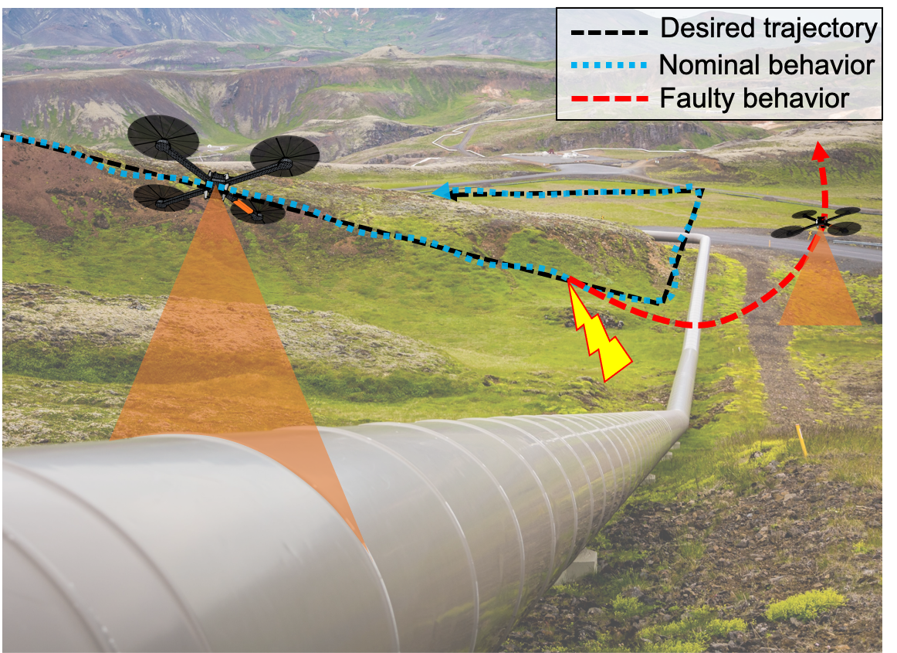
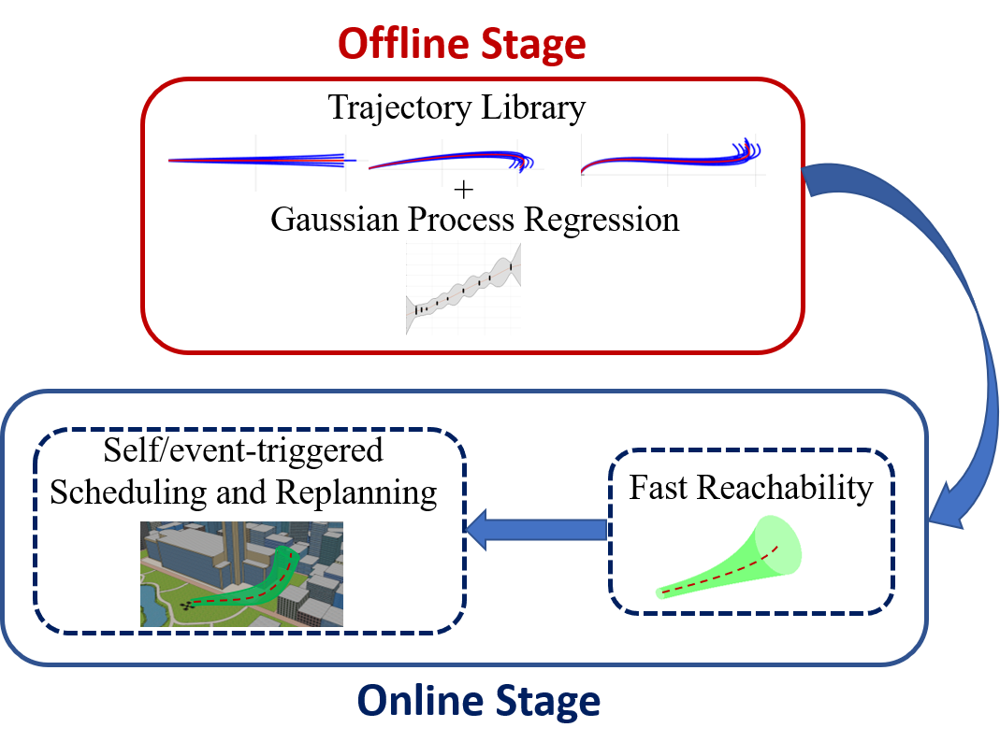
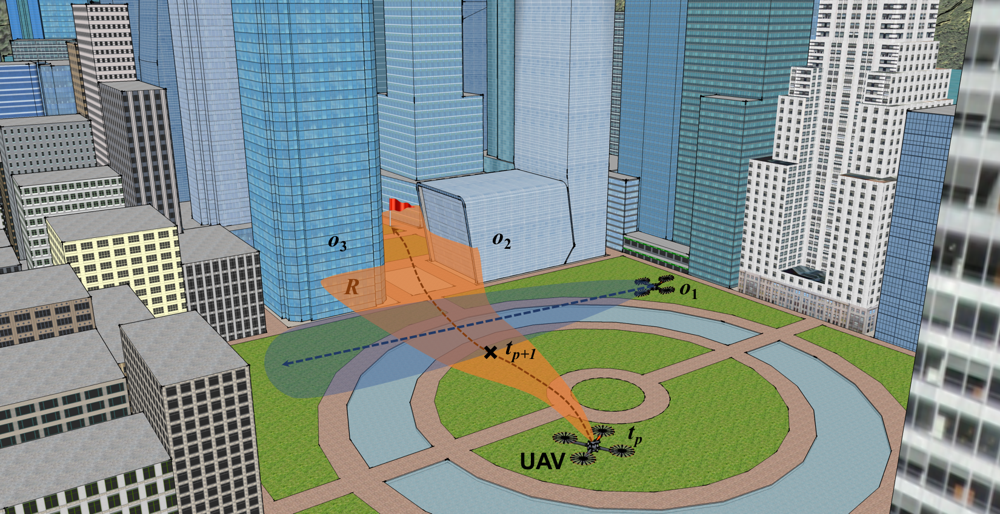

Reliable Intelligent Systems Lab (RISL) at Rensselaer Polytechnic Institute (RPI) will research methods for improving the safety, trustworthiness, and generalizability of intelligent systems starting in January 2024. The topics of interest include reachability analysis, decision-making under uncertainty, runtime monitoring, behavior modeling, and transfer learning. The lab's application areas include aerial robotics, mobile robot navigation, and autonomous driving. 

**How to Join**

RISL will hire multiple Ph.D. students for Fall 2024. If you are interested in doing research in the areas below, please consider submitting a Ph.D. application to [ECSE at RPI](https://ecse.rpi.edu/ "ECSE") (Deadline: January 1, 2024). If you have specific questions or research ideas, please reach out to Esen Yel by email (esenyel@stanford.edu) with the subject line "Interested in joining RISL".

Research Areas
=====

Adaptation to Unforeseen Situations
-----

   

Autonomous systems may need to operate under different conditions than they have been designed for (e.g., unforeseen faults, different environment settings, etc.). To deal with this problem, the systems need to be able to adapt their models to new situations without the need for large amounts of data. Our body work has focused on leveraging meta-learning and Bayesian techniques to provide adaptation to unforeseen conditions.

**Relevant Publications:**
* A. Yildiz,  **E. Yel**, A. Corso, K. Wray, S. Witwicki and M. Kochenderfer, "_Experience filter: Transferring past experiences to unseen  tasks or environments_", IEEE Intelligent Vehicles Symposium (IV) 2023 [PDF]([https://arxiv.org/pdf/2209.13172.pdf](https://arxiv.org/pdf/2305.18633.pdf) "IV'23")
* **E. Yel***, Shijie Gao*, N. Bezzo, ”_Meta-Learning-based Proactive Online Planning for UAVs under Degraded Conditions_”, (*equal contribution), Robotics and Automation Letters (RA-L), 2022 [PDF](https://ieeexplore.ieee.org/document/9832491 "RAL'22")
* **E. Yel**, N. Bezzo, ”_A Meta-Learning-based Trajectory Tracking Framework for UAVs under Degraded Conditions_” IEEE/RSJ International Conference on Intelligent Robots and Systems (IROS) 2021 [PDF](https://arxiv.org/abs/2104.15081 "IROS'21")

Runtime Planning, Learning, and Recovery under Unforeseen Disturbances
-----

Autonomous systems are typically designed and trained to work under certain system and environmental conditions. However, in real-world applications, the system may face unexpected situations such as component failures, variation in payload distribution or changes in model dynamics at runtime. Such factors could lead the system to undesired conditions if they are not properly taken into consideration. 

To provide safety under unforeseen distrurbances at runtime,  a fast online planning, learning, and recovery approach is introduced. By leveraging Gaussian Process regression theory in which a model is continuously trained and adapted using data collected during the autonomous operation, the disturbance and its effects are predicted at runtime to plan safe trajectories. This approach is validated on simulations and experiments on a UAV carrying an unknown payload outside of the training bounds.  More details, simulation and experimental results can be found in the paper: [IROS'20](https://ieeexplore.ieee.org/document/9341641 "IROS'20").

Assured Runtime Monitoring and Planning
-----

Uncertain environments with the presence of disturbances and noises may lead the autonomous systems to reach unsafe states (e.g., collisions with obstacles) even while using well-tuned and precise controllers. Reachability analysis tools are very powerful to predict the future states of the system and provide safety guarantees, however they are challenging to use at runtime due to their computational complexity. Instead, we propose to use neural networks (NNs) to imitate the safety decisions of reachability tools by training the networks at the design time using reachability tools. The decisions of the neural network are used to replan trajectories when necessary. To guarantee that the NNs will make conservative safety decisions, they are verified using a closed-loop verification tool, Verisig. Verification results are also leveraged to retrain networks accordingly.  With this approach, the reachable set computation is limited to the offline stage, and safety-assured trajectories are designed at runtime in both known and unknown environments. More details, simulation and experimental results can be found in the article: [RAM '20](https://ieeexplore.ieee.org/document/9068251 "RAM'20").

GP-based Fast Runtime Monitoring and Recovery
-----

Traditional unmanned aerial vehicle applications rely on constant sensor measurements for localization. However, in real-world applications, these sensor measurements can be interrupted due to various reasons such as sensor failures, signal occlusions, and communication problems (e.g., losing GPS signal while moving in a city around tall buildings). 

To guarantee the safety of the UAVs under intermittent sensing, we introduce a novel fast reachability approach which leverages Gaussian process regression to predict the future deviations at runtime. These reachable sets are then utilized to schedule when the system needs to monitor, replan its trajectories and perform recovery to continue safe operations. More details can be found in the paper: [IROS'19](https://ieeexplore.ieee.org/document/8968498 "IROS'19").

Reachability-based Self/Event-triggered Scheduling and Replanning
-----

High-frequency  periodic sensor measurements are usually expected for a traditional system to safely navigate in environments occupied with obstacles. However, monitoring the sensors and processing the sensor measurements at high-frequency are computationally consuming, and often not necessary especially when the vehicle is operating in obstacle-free environments. To minimize the computation associated with the sensor monitoring while guaranteeing safety, reachability analysis is leveraged to capture the future states of a UAV operating
under the effects of noise and disturbances in both static and dynamic environments under external disturbances and noises. 
Self-triggered scheduling is then utilized to compute when the system needs to perform sensor monitoring. 

**Relevant Publications**
* **E. Yel**, Tony X. Lin, N. Bezzo, ”_Computation-Aware Adaptive Planning and Scheduling for Safe Unmanned Airborne Operations_” Journal
of Intelligent and Robotic Systems, 2020 [PDF](https://link.springer.com/epdf/10.1007/s10846-020-01192-2?sharing_token=qFtm8fdhrw7rGoxGSkag9Pe4RwlQNchNByi7wbcMAY7a0qUIrsI7Gsc1PxE0C73W76eRLdTfLaDkqH1k2r_lFJDR2pmTLZvq7Px2rnuCcKWhnHiTmHhqX_j3X_xVtcUXJzzrkbBCBQCbOpqqYUGu44c7CmLWpuWDkN5dZ2i4Jfk%3D "JINT'20")
* **E. Yel**, T. X. Lin and N. Bezzo, ”_Self-triggered Adaptive Planning and Scheduling of UAV Operations_,” IEEE International Conference on Robotics and Automation (ICRA), Brisbane, 2018 [PDF](https://ieeexplore.ieee.org/document/8463205 "ICRA'18")
* **E. Yel**, T. X. Lin and N. Bezzo, ”_Reachability-based self-triggered scheduling and replanning of UAV operations_,” NASA/ESA Conference on Adaptive Hardware and Systems (AHS), Pasadena, CA, 2017, pp. 221-228. [PDF](https://ieeexplore.ieee.org/document/8046382 "AHS'17") 

